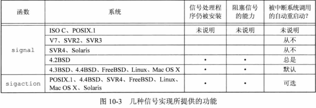
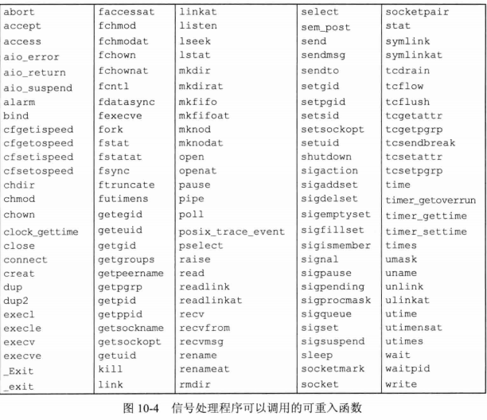
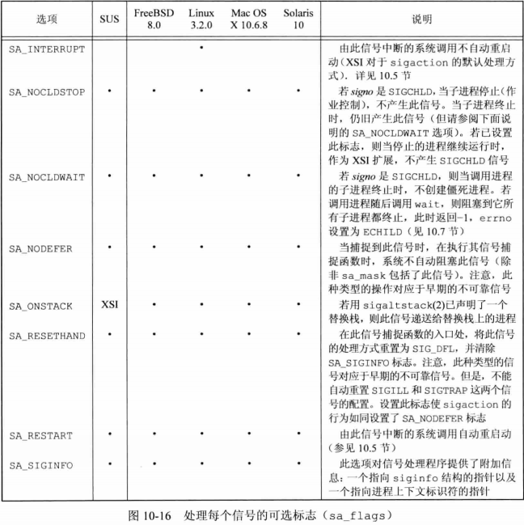
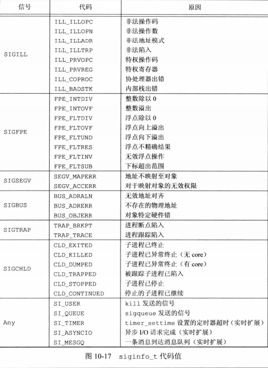
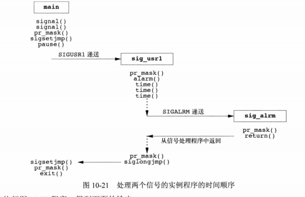

## <center>信号</center>

* <sys/signal.h> 或 <bits/signum.h>
* 关键是不要丢失信号


### signal
* func 是常量SIG_IGN 常量SIG_DFL 或当接到此信号号要调用的函数的地址
```c
#include <signal.h>
void (\*signal(int isgno,void (\*func)(int)))(int);
//返回：成功，返回以前的信号处理配置，出错，SIG_ERR

typedef void Sigfunc(int);
Sigfunc *signal(int,Sigfunc *);
```
[example](signalo.c)
```s
$ ./signalo & #后台运行
$ kill -USR1 $(pidof signalo)
$ kill -USR2 $(pidof signalo)
$ kill $(pidof signalo)
```

* exec函数将原先设置为要捕捉的信号都更改为默认动作
* 当一个进程调用fork时，其子进程继承父进程的信号处理方式
```c
//仅当SIGINT和SIGQUIT当前未被忽略时，进程才会被捕捉他们
void sig_int(int),sig_quit(int);
if(signal(SIGINT,SIG_IGN)!=SIG_IGN)
  signal(SIGINT,sig_int);
if(signal(SIGQUIT,SIG_IGN)!=SIG_IGN)
  signal(SIGQUIT,sig_quit);
```

### 中断的系统调用
* 当捕捉到某个信号时，被中断的是内核中执行的系统调用
* 系统调用
  - 低速系统调用
  - 其他系统调用

```c
again:
    if((n=read(fd,buf,BUFFSIZE))<0)
    {
      if(errno==EINTY)
         goto again;
      /* handle other errors */
    }
```
* 自动重启的系统调用
  - ioctl
  - read
  - readv
  - write
  - writev
  - wait
  - waitpid



### 可重入函数
* 异步信号安全的(async-signal safe)
* 除可重入外，在信号处理期间，会阻塞任何会引起不一致的信号发送
* 不可重入条件
  - 使用静态数据结构
  - 调用malloc或free
  - 标准I/O函数
* 每个线程只有一个errno变量，调用重入函数前保存errno，调用后恢复errno


* [SIGCLD](sigcldo.c)
  - 默认 SIG_DFL "忽略"
  - SIG_IGN 不产生僵尸进程，wait等待所有子进程结束，返回-1，errno=ECHILD
  - 捕获

### 可靠信号术语和语义
* 信号产生
* 递送：当一个信号产生时，内核通常在进程表中以某种形式设置一个标志
* 未决的：信号产生和递送之间的时间间隔内
* 阻塞信号递送：不接收该信号？？ 
* 内核在递送一个原来被阻塞的信号给进程时(而不是在产生该信号时)，才觉得对它的处理方式。于是进程在信号递送给它之前仍可以改变对该信号的动作。调用sigpending判断信号是设置为阻塞并处于未决状态
* 信号屏蔽字：规定了当前要阻塞递送到该进程的信号集 sigset_t 容纳信号集

### 函数kill和raise
* kill 函数将信号发送给进程或进程组
  - pid > 0 进程
  - pid == 0 和自己同一进程组
  - pid < 0 |pid| 进程组
  - pid == -1 所有可发送的进程
* raise 函数允许进程向自身发送信号

```c
#include <signal.h>
int kill(pid_t pid,int signo);
int raise(int signo);
//返回：成功0出错-1
```

### 函数alarm和pause
* alarm
  - 会清除之前的闹钟
  - signal需要保存之前的handler
  - alarm和pause之间的竞争关系
  - 可用longjump，但是会影响其他信号
* pause 使调用进程挂起直至捕捉到一个信号
  直到执行了一个信号处理程序并从其返回时，pause才返回
```c
#include <unistd.h>
unsigned int alarm(unsigned int seconds); //参数0清除
//返回：0 或以前设置的闹钟时间的余留秒数 

int pause(void);
//返回：-1，errno 设置为 EINTY
```

### 信号集

```c
#include <signal.h>
int sigemptyset(sigset_t *set);
int sigfillset(sigset_t *set);
int sigaddset(sigset_t *set,int signo);
int sigdelset(sigset_t *set,int signo);
//返回：成功，0，失败 -1
int sigismember(const sigset_t *set,int signo);
//返回：真 1 假 0
int sigprocmask(int how,const sigset_t *restrict set,sigset_t *restrict oset);
//返回：成功 0 ，出错 -1
```
[sigset](sigseto.c)

* sigprocmask 设置或修改屏蔽字
  - oset 非空，返回当前信号屏蔽字
  - set
    - 非空 
      - 见下图
    - 空 不改变
  - 调用后，如果有任何未决的不再阻塞的信号，则在其返回前，至少将其中之一传递给该进程


* sigpending 返回调用进程阻塞的信号[sigpending](sigpendingo.c)

```c
#include <signal.h>
int sigpending(sigset_t *set);
//返回：成功 0 ，失败 -1
```

### sigaction

* 如果设置了 SA_SIGINFO 标志，按下方式调用信号处理程序   
  `void handler(int signo,siginfo_t *info,void *contetxt)` 

```c
#include <signal.h>

struct sigaction {
  void (*sa_handler)(int);
  sigset_t sa_mask;
  int sa_flags;
  void (*sa_sigaction)(int,siginfo_t *,void *);
}
struct siginfo {
  int si_signo;            /* signal number */
  int si_errno;            /* if nonzero,errno value from <errno.h> */
  int si_code;             /* additional info (depends on signal) */
  pid_t si_pid;            /* sending process ID */
  uid_t si_uid;            /* sending process real user ID */
  void \*si_addr;          /* address that caused the fault */
  int si_status;           /* exit value or signal number */
  union sigval si_value;   /* appllication-specific value */
}

union {
  int sival_int;
  void *sival_ptr;
} si_value;

struct ucontext_t {
  ucontext_t *uc_link;
  sigset_t un_sigmask;
  stack_t uc_stack;
  mcontext_t uc_mcontext;
}

struct uc_stack {
  void \*ss_sp;    /* stack base or pointer */
  size_t ss_size;
  int ss_flags;
}
int sigaction(int signo,const struct sigaction *restirct act,
struct sigaction *restrict oact);
//返回：成功 0 出错 -1
```




### 函数sigsetjmp和siglongjmp

* 处理信号屏蔽字
* 如果savamask非0，sigsetjmp在env中保存进程的当前信号屏蔽字，从siglongjmp恢复
```c
#include <setjmp.h>
int sigsetjmp(sigjmp_buf env,int savemask);
//返回：直接调用，0，若从siglongjmp返回，返回val
void siglongjmp(sigjmp_buf env,int val);
```
[sigsetjmp](sigsetjmpo.c)


### 函数sigsuspend
* 设置sigmask -> 挂起 -> 恢复屏蔽字
* 原子操作中先恢复信号屏蔽字然后使进程休眠
* 在捕捉到一个信号或发生了一个终止该进程的信号前，改进程被挂起
* 如果捕捉到一个信号且从该信号处理程序返回，则sigsuspend返回，信号屏蔽字恢复
```c
#include <signal.h>
int sigsuspend(const sigset_t *sigmask);
//返回：-1，并将errno设置为EINTR
```

* [保护代码临界区，使其不被特定信号中断](sigpendingo.c)

* [等待一个信号处理程序设置一个全局变量]