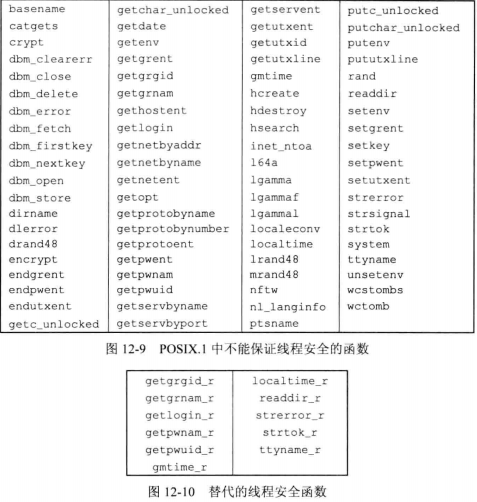
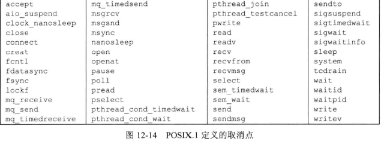
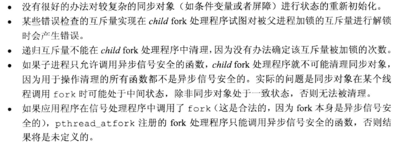

## <center>线程属性</center>

### 线程属性
* detachstate
  -  PTHREAD_CREATE_DETACHED 以分离状态启动线程
  -  PTHREAD_CREATE_JOINABLE 正常启动线程

* 线程栈 getstack setstack
- 编译阶段 _POSIX_THREAD_ATTR_STACKADDR 和 _POSIX_THREAD_ATTR_STACKSIZE 
- 运行阶段 _SC_THREAD_ATTR_STACKADDR 和  _SC_THREAD_ATTR_STACKSIZE  ->sysconf
- stackaddr线程属性被定义为栈的最低内存空间，通过malloc或mmap分配的地址
- setstacksize 选择的stacksize不能小于 PTHREAD_STACK_MIN
- guardsize控制线程栈末尾之后用以避免溢出的扩展内存大小，如果设置stackaddr则guardsize默认为0
```c
#include<pthread.h>
int pthread_attr_init(pthread_attr_t *attr);
int pthread_attr_destroy(pthread_attr_t *attr);

//PTHREAD_CREATE_DETACHED
//PTHREAD_CREATE_JOINABLE
int pthread_attr_getdetachstate(const pthread_attr_t *restrict attr,int *detachstate);
int pthread_attr_setdetachstate(pthread_attr_t *attr,int *detachstate);

//设置线程栈地址
int pthread_attr_getstack(const pthread_attr_t *restrict attr,void **restrict stackaddr,size_t *restrict stacksize);
int pthread_attr_setstack(pthread_attr_t *attr,void *stackaddr,size_t stacksize);

//设置线程属性stacksize,希望改变栈的默认大小但又不想自己处理线程栈的分配问题
int pthread_attr_getstacksize(const pthread_attr_t *restrict attr,size_t *restrict stacksize);
int pthread_attr_setstacksize(pthread_attr_t *attr,size_t stacksize);

//设置线程栈末尾之后用以避免栈溢出的扩展内存大小
int pthread_attr_getguardsize(const pthread_attr_t *restrict attr,size_t *restrict guardsize);
int pthread_attr_setguardsize(pthread_attr_t *attr,size_t guardsize);
//返回：成功 0 ，否则 错误编号
```
### 同步属性
* 互斥量属性 pthread_mutexattr_t 
* _POSIX_THREAD_PROCESS_SHARED 和 _SC_THREAD_PROCESS_SHARED ->sysconf
* 3个属性
  - 进程共享属性 PTHREAD_PROCESS_PRIVATE  PTHREAD_PROCESS_SHARED
  - 健壮属性 PTHREAD_MUTEX_STALLED PTHREAD_MUTEX_ROBUST
  - 类型属性
```c
#include <pthread.h>

//默认
pthread_mutex_t lock = PTHREAD_MUETX_INITIALIZER;
int pthread_mutex_init(pthread_mutex_t *restrict mutex,const pthread_mutexattr_t *restrict attr);
//非默认属性
int pthread_mutexattr_init(pthread_mutexattr_t *attr);
int pthread_mutexattr_destroy(pthread_mutexattr_t *attr);

//PTHREAD_PROCESS_PRIVATE 进程内使用锁
//PTHREAD_PROCESS_SHARED 多个进程彼此共享内存数据块中分配的互斥量
int pthread_mutexattr_getpshared(const pthread_mutexattr_t *restrict attr,int *restrict pshared);
int pthread_mutexattr_setpshared(pthread_mutexattr_t *attr,int pshared);

//PTHREAD_MUTEX_STALLED 持有互斥量的进程终止时不需要采取特别的动作，其他等待互斥量的会被拖住
//PTHREAD_MUTEX_ROBUST  上述情况会导致 pthread_mutex_lock返回EOWNERDEAD错误
int pthread_mutexattr_getrobust(const pthread_mutexattr_t *restrict attr,int *restrict robust);
int pthread_mutexattr_setrobust(pthread_mutexattr_t *attr,int robust);

//如果应用状态无法恢复，在线程对互斥量解锁后，该互斥量将永久不可用状态
//[consistent](../../image/consistent.png)
int pthread_mutex_consistent(pthread_mutex_t *mutex);
int pthread_mutexattr_gettype(const pthread_mutexattr_t *restrict attr,int *restrict type);
int pthread_mutexattr_settype(pthread_mutexattr_t *restrict attr,int *restrict type);
//返回：成功 0 失败 错误编号
```

### 读写锁属性

```c
#include<pthread.h>
int pthread_rwlockattr_init(pthread_rwlockattr_t *attr);
int pthread_rwlockattr_destroy(pthread_rwlockattr_t *attr);

int pthread_rwlockattr_getpshared(const pthread_rwlockattr_t *restrict attr,int *restrict pshared);
int pthread_rwlockattr_setpshared(pthread_rwlockattr_t *attr,int pshared);
//返回：成功 0 否则 错误编号

```

### 重入
* 如果一个函数在相同的时间点可以被多个线程安全的调用，就称该函数是线程安全的
* 如何一个函数对多个线程来说是可重入的，就说这个函数就是线程安全的
* 如果函数对异步信号处理程序的重入是安全的，那么就可以说函数是异步信号安全的



```c
#include<stdio.h>
int ftrylockfile(FILE *fp);
//成功：0 错误 非0
void flockfile(FILE *fp);
void funlockfile(FILE *fp);

//不加锁版本的基于字符的标准I/O例程
int getchar_unlock(void);
int getc_unlocked(FILE *fp);
//返回：成功 下一个字符 文件末尾或错误 EOF

int putchar_unlocked(int c);
int putc_unlocked(int c,FILE *fp);
//返回：成功 c,出错 EPF
```
* 必须使用递归互斥量阻止其他线程改变我们正需要的数据结构，还有阻止来自信号处理程序的死锁

### 线程特定数据
* 存储和查询某个特定线程相关数据的一种机制
* 一个进程中的所有线程又可以访问这个进程的整个地址空间
* 在分配线程特定数据之前，需要创建与该数据关联的键

* pthread_key_create
  - 每个线程把这个键与不同的线程特定数据地址进行关联
  - destructor 析构函数
  - exit _exit _Exit或abort 或其他非正常退出时，不会调用析构函数
  - PTHREAD_KEYS_MAX 对进程可分配的键的数量进行限制
* pthread_once
 - initflag必须为非本地变量(全局或静态变量),而且必须初始化为PTHREAD_ONCE_INIT
```c
#include<pthread.h>
int pthread_key_create(pthread_key_t *keyp,void (*destructor)(void *));
int pthread_key_delete(pthread_key_t key);//不会调用析构函数

pthread_once_t initflag = PTHREAD_ONCE_INIT;
int pthread_once(pthread_once_t *initflag,void (*initfn)(void));
//返回：成功 0 否则 错误编号

void *pthread_getspecific(pthread_key_t key);
//返回：线程特定数据值，若没有值与该键关联，返回NULL
int pthread_setspecific(pthread_key_t key,const void *value);
//返回：成功 0 否则 错误编号
```

### 取消选项

* 影响pthread_cancel函数调用时所呈现的行为
 - PTHREAD_CANCEL_ENABLE
 - PTHREAD_CANCEL_DISABLE
* pthread_cancel 调用并不等待线程终止，直到取消点
* 线程默认状态是 PTHREAD_CANCEL_ENABLE 
* PTHREAD_CANCEL_DISABLE 时，pthread_cancel调用不会杀死线程，而等回复ENABLE后在下一个取消点对挂起的取消请求处理
```C
#include<pthread.h>
int pthread_setcancelstate(int state,int *oldstate);//原子操作
//返回：成功 0 失败 错误编号
void pthread_testcancel(void);

//取消类型
//PTHREAD_CANCEL_DEFERRED  延迟 遇到取消点才能被取消
//PTHREAD_CANCEL_ASYNCHRONOUS  异步 在任意时间撤销
int pthread_setcanceltype(int type,int *oldtype);
```



### 线程和信号
* 信号的处理是进程中所有线程共享的
* 进程中的信号是递送到单个线程的(故障发给当前线程，其他任意一个线程)
* sigwait 线程等待信号
 - signop 包含发送信号的数量
 - 如果信号集中的某个信号在sigwait调用的时候处于挂起状态，那么sigwait将无阻塞的返回
 - 调用sigwait的时候，先阻塞正在等待的信号，sigwait会原地取消信号集的阻塞状态，直到有新的信号被递送，在返回之前，sigwait将恢复线程的信号屏蔽字
 - 多个线程在sigwait的调用中因等待同一个信号阻塞，那么信号递送的时候，就有一个线程可以从sigwait中返回

* 如果信号的默认处理动作片是终止该进程，那么吧信号传递给某个线程将杀死整个进程
* 闹钟定时器是进程资源，所有线程共享相同的闹钟，所以进程中的多个线程不可能互不干扰地使用闹钟定时器
```c
#include<pthread.h>
int pthread_sigmask(int how,const sigset_t *restrict set,sigset_t *restrict oset);
int sigwait(const sigset_t *restrict set,int *restrict signop);
int pthread_kill(pthread_t thread,int signo);
//返回：成功 0 失败 错误编号
```
[example](sigmasko.c)

### 线程和fork
* 子进程通过继承整个地址空间的副本，还从父进程那儿继承了每个互斥量、读写锁和条件变量的状态
* 在子进程内部，只有一个线程，是由父进程中调用fork的线程的副本构成的
* 继承了锁但没有锁和线程对应关系
* 在fork返回和子进程调用其中一个exec之间，子进程只能调用异步安全的函数
* 参数
  - prepare 父进程 fork 之前 获取父进程的所有锁
  - parent 父进程上下文 fork 和 return 之间 对所有prepare获取的所有锁进行解锁
  - child  子进程上下文 fork返回之前 对所有prepare获取的所有锁进行解锁
```c
#include<pthread.h>
int pthread_atfork(void (*prepare)(void),void (*parent)(void),void (*child)(void));
//返回：成功0 失败 错误编号
```
[examlpe](atforko.c)


### 线程和I/O
* 进程中的所有线程共享相同的文件描述符
* pread 和 pwrite 将偏移量的设定和数据的读取成为一个原子操作