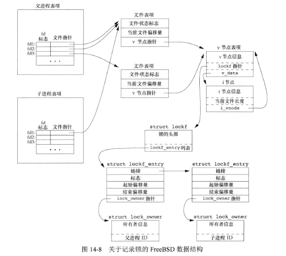

## <center>高级I/O</center>

### 非阻塞I/O
* open O_NONBLOCK
* fcntl O_NONBLOCK

* 终端驱动程序一次能接受的数据量随系统而变

### 记录锁

```c
#include<fcntl.h>
struct flock {
  short l_type;   /* F_RDLCK, F_WRLCK, F_UNLCK */
  short l_whence; /* SEEK_SET, SEEK_CUR, SEEK_END */
  off_t l_start;  /* offset in bytes,relation to l_whence * /
  off_t l_len;    /* length,in bytes;0 means lock to EOF */
  pid_t pid;      /* returned with F_GETLK */
}
int fcntl(int fd,int cmd,.../* struct flock *flockptr */);
//返回值：成功 依赖cmd，否则 -1
```
* 如果一个进程对同一个文件区已经有了一把锁，后来该进程又企图在同一文件区间再加一把锁，那么新锁会替换已有锁
* 加读锁，必须读打开；加写锁，必须写打开
* F_GETLK 判断由flockptr所描述的锁是否被另一把锁排斥(阻塞)。如果存在一把锁，阻止创建由flockptr所描述的锁，现有锁的信息重写flockptr指向的信息

* 锁的作用是阻止多个进程同时写同一个文件

* 锁的隐含继承和释放
  1. 锁与进程和文件两者关联
    - 当一个进程终止时，它所建立的锁全部释放
    - 描述符关闭，该进程通过这一描述符引用的文件上的任何一把锁都会释放
  
  2. 由fork产生的子进程不继承父进程设置的锁
  3. 在执行exec后，新程序可以继承原执行程序的锁

>FreeBSD实现
```c
fd1 = open(pathname,...);
write_lock(fd1,0,SEEK_SET,1);
if((pid=fork())>0)
{
   fd2=dup(fd1);
   fd3=open(pathname,...);
}else if(pid==0)
{
  read_lock(fd1,1,SEEK_SET,1);
}
pause();
```


* 建议性锁和强制性锁
 - 强制性锁：打开其设置组ID位，关闭其组执行位便开启 对该文件的强制性锁机制  
   `chmod(filename,(stat.st_mode & ~S_IXGRP | S_ISGID))`
 - 强制性锁会让内核检查每一个open,read和write,验证调用过程是否违背了正在访问的文件上的某一把锁

