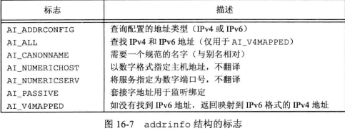
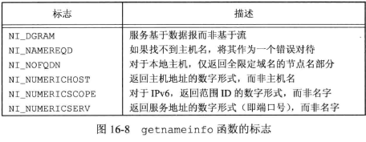

## <center>网络IPC：套接字</center>
* 套接字描述符在UNIX系统中被当做是一种文件描述符
* 最高有效字节(MSB)：多字节序列中具有最大权重的字节
* 大端法(BE):数据的高字节(MSB)保存在内存的高地址中
* TCP/IP协议栈使用大端字节序

* socket - domain
   域    |    描述
---------|------------
AF_INET  | IPv4因特网域
AF_INET6 | IPv6因特网域
AF_UNIX  | UNIX域
AF_UPSPEC| 未指定

* socket - type

类型           | 描述
---------------|-----------------------------------
SOCK_DGRAM     | 固定长度的、无连接的、不可靠的报文传递
SOCK_RAM       | IP协议的数据报接口(在POSIX.1中为可选)
SOCK_SEQPACKET | 固定长度的、有序的、可靠的、面向连接的报文传递
SOCK_STREAM    | 有序的、可靠的、双向的、面向连接的字节流

* socket - protocal

协议          | 描述
-------------|-----------
IPPROTO_IP   | IPv4网际协议
IPPROTO_IPV6 | IPV6网际协议(POSIX.1中为可选)
IPPROTO_ICMP | 因特网控制报文协议
IPPROTO_RAM  | 原始IP数据包协议(POSIX.1中为可选)
IPPROTO_TCP  | 传输控制协议
IPPROTO_UDP  | 用户数据报协议

* 点分十进制(a.b.c.d) 
  - inet_addr 
  - inet_ntoa
  - inet_pton 将文本字符串格式转换成网络字节序的二进制地址
  - inet_ntop 将网络字节序的二进制地址转换成文本字符串格式
    - domain 只支持 AF_INET 和 AF_INET6
    - size   存放文本字符串的缓冲区 INET_ADDRSTRLEN  INET6_ADDRSTRLEN

```c
#include <sys/socket.h>

//Linux
struct sockaddr {
  sa_family_t  sa_family;
  char         sa_data[14];
};

//FreeBSD
struct sockaddr {
  unsigned char sa_len;
  sa_family     sa_family;
  char          sa_data[14];
};

#include <netinet/in.h>

//IPv4
struct in_addr {
  in_addr_t    s_addr;  /*uint32_t*/
};

//IPv4
struct sockaddr_in {
  sa_family_t    sin_family;
  in_port_t      sin_port; /*uint16_t*/
  struct in_addr sin_addr;
  unsigned char  sin_zero[8]; /*filter for Linux*/
};

//IPv6
struct in6_addr {
  uint8_t        s6_addr[16];
}
//IPv6
struct sockaddr_in6 {
  sa_family_t     sin6_family;
  in_port_t       sin6_port;
  uint32_t        sin6_flowinfo; /*traffic class and flow info*/
  struct in6_addr sin6_addr;
  uint32_t        sin6_scope_id; /*set of interfaces for scope*/
}

int socket(int domain,int type,int protocal);
//返回：成功，文件(套接字)描述符，出错 -1

int shutdown(int sockfd,int how);
//返回：成功 0 出错 -1

//主机字节序与网络字节序转换 h 主机 n 网络 l 长 s 短
#include<arpa/inet.h>
uint32_t  htonl(uint32_t  hostint32);
uint16_t  htons(uint16_t  hostint16);
uint32_t  ntohl(uint32_t  netint32);
uint16_t  ntohs(uint16_t  netint16);

const char *inet_ntop(int domain,const void *restrict addr,char *restrict str,socklen_t size);
//返回：成功 地址字符串指针，出错 NULL
int inet_pton(int domain,const char *restrict str,void *restrict addr);
//返回：成功 1 格式无效 0 出错 -1

#include <netdb.h>

//计算机的主机信息
struct hostent {
  char *h_name;  /*name of host*/
  char **h_aliases;
  int  h_addrtype;
  int  h_length;
  char **h_addr_list;
  ...
}
struct hostent *gethostent(void);
//返回：成功 指针 失败 null
void sethostent(int stayopen);//回绕
void endhostent(void);//关闭文件

//获得网络名字和网络编号
struct netent {
  char *n_name;   /*network name*/
  char **n_aliases;
  int  n_addrtype;
  uint32_t n_net;
  ...
}
struct netent *getnetbyaddr(uint32_t net,int type);
struct netent *getnetbyname(const char *name);
struct netent *getnetent(void);
//返回：成功，指针，出错 NULL
void setnetent(int stayopen);
void endnetent(void);

//协议名字和协议编号之间进行映射
struct protoent {
  char *p_name;  /*protocol name*/
  char **p_aliases;
  int  p_proto;
  ...
}
struct protoent *getprotobyname(const char *name);
struct protoent *getprotobynumber(int proto);
struct protoent *getprotoent(void);
//返回：成功 指针 出错 nULL
void setprotoent(int stayopen);
void endprotoent(void);

struct servent {
  char *s_name; /*service name*/
  char **s_aliases;
  int  s_port;
  char *s_proto;
  ...
}
struct servent *getservbyname(const char *name,const char *proto);
struct servent *getservbyport(int port,const char *proto);
struct servent *getservent(void);
//返回：成功 指针 出错 null
void setservent(int stayopen);
void endservent(void);

```

* getaddrinfo 允许将一个主机名和一个服务名映射到一个地址
  - 返回一个链表结构的[addrinfo](../../image/getaddrinfo.png)
  - hint 用于过滤地址的模板
  - ai_flags



```c
#include <sys/socket.h>
#include <netdb.h>
struct addrinfo {
  int              ai_flags;
  int              ai_family;
  int              ai_socktype;
  int              ai_protocal;
  socklen_t        ai_addrlen;
  struct sockaddr *ai_addr;
  char            *ai_canonname;
  struct addrinfo *ai_next;
  ...
};

int getaddrinfo(const char *restrict host,
                const char *restrict service,
                const struct addrinfo *restrict hint,
                struct addrinfo **restrict res);
//返回：成功 0 出错 非0错误码
void freeaddrinfo(struct addrinfo *ai);
const char *gai_strerror(int error);
//返回：指向描述错误的字符串的指针
```

* getnameinfo 将一个地址转换成一个主机名和一个服务名

```c
#include <sys/socket.h>
#include <netdb.h>
int getnameinfo(const struct sockaddr *restrict addr,socklen_t alen,
                const *restrict host,socklen_t hostlen,
                char *restrict service,socklen_t servlen,int flags);
//返回：成功 0 出错 非0值
```



[网络编程](../../tcp-ip/unix网络编程卷1/ch8.md)
[网络编程](../../tcp-ip/unix网络编程卷1/ch14.md)

* 如果connect连接失败，套接字的状态会变成未定义的
  - 因此，如果connect失败，可迁移的应用程序需要关闭套接字
* 合适选择合适的套接字类型？我们要做的工作量和能够容忍的出错程度