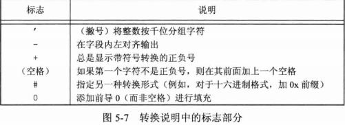
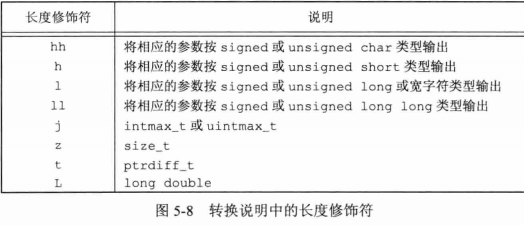
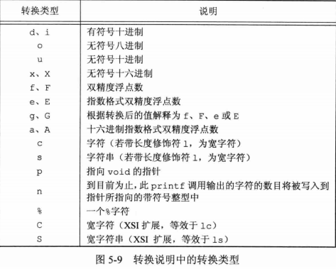
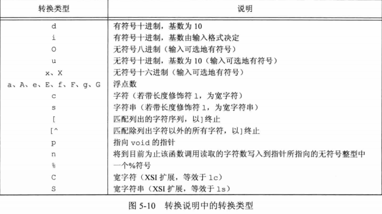

## <center> 标准I/O库 </center>

* restrict  
  类型限定符，告诉编译器，对象已经被指针所引用，不能通过除改指针外所有其他直接或间接的方式修改对象的内容

```c
#include <stdio.h>
void setbuf(FILE *restrict fp,char *restrict buf);
void setvbuf(FILE *restrict fp,char *restrict buf,int mode,size_t size);
//返回：若成功，返回0，若出错，返回非0
int fflush(FILE *fp)
//返回：若成功，返回0，若出错，返回EOF
//使该流所有未写的数据都被传送至内核
```


### 打开流

```c
#include <stdio.h>
FIFE *fopen(const char *restrict pathname,const char *restrict type);
FILE *freopen(const char *restrict pathname,const char *restrict type,FILE *restrict fp);
FILE *fdopen(int fd,const char *type);
//返回：若成功， 返回文件指针，出错，返回null
fclose(FILE *fp); 
//返回：若成功，返回0，出错，返回EOF
```


* 当一个进程正常终止时，所有带未写缓冲数据的标准I/O流都被冲洗，所有打开的标准I/O流都被关闭

### 读和写流
* 非格式化I/O
  - 每次一个字符的I/O
  - 每次一行的I/O，fgets fputs
  - 直接I/O,fread fwrite  二进制I/O，一次一个对象I/O、面向记录的I/O或面向结构的I/O

```c
#include <stdio.h>
//输入函数
int getc(FILE *fp);
int fgetc(FILE *fp);
int getchar(void); //getc(stdin)
//返回：若成功，返回下一个字符，若已到达文件尾端或出错，返回EOF

int ferror(FILE *fp);
int feof(FILE *fp);
//返回：条件为真，返回非0，否则返回0(假)
void clearerr(FILE *fp);
//清除 出错标志 和 文件结束标志

int ungetc(int c,FILE *fp);
//返回：成功，返回c，出错，返回EOF
//将字符压送回流中，相当于栈，只是写会标准I/O库的流缓冲区中

//输出函数
int putc(int c,FILE *fp);
int fputc(int c,FILE *fp);
int putchar(int c);// putc(c,stdout)
//返回：成功 0 ，出错 EOF


//每次一行I/O
//输入
char *fgets(char *restrict buf,int n,FILE *restrict fp);
char *gets(char *buf);
//返回：成功，返回buf, 文件尾或出错，NULL
//输出
int fputs(const char *restrict str,FILE *restrict fp);
int puts(const char *str);
//返回：若成功，返回非负值，出错，EOF
```

* getc 可被实现为宏，而fgetc不能实现为宏
* 为区分出错还是到达文件尾端，必须调用 ferror或feof
* 压送不能是EOF，但已到达文件尾端，仍可以会送一个字符
  一次成功的ungetc调用会清除改流的文件结束标志

* fgets 一直读到换行符为止，但是不超过n-1个字符  
  该缓冲区以null字节结尾（换行符--> null），超过缓冲区长度会缓冲区溢出
* gets并不将换行符存入缓冲区，而fgets会
* 通过 null 判断是否行结尾，换行符当普通字符输出 \t\r+null ?
### I/O缓冲和内核缓冲

终端  ------------>  I/O 缓冲区  ------------>  内核缓冲区
      标准I/O函数                 read/write

read/write 默认以BUFSIZE读写内核缓冲


### 二进制I/O

```c
#include <stdio.h>
size_t fread(void *restrict ptr,size_t size,size_t nobj,FILE *restrict fp);
size_t fwrite(const void *restrict ptr,size_t size,size_t nobj,FILE *restrict fp);
//返回：读或写的对象数
```

* size 读/写每个单位的长度，nobj 读/写单位的个数
* 出错或到达文件尾端，返回数字小于nobj,应调用ferror和feof判断哪个原因
* 不同系统，可能会有问题
  - 同一结构中，同一个成员的偏移量可能随编译程序和系统的不同而不同
  - 用来存储多字节整数和浮点值的二进制格式在不同的系统结构件也可能不同


### 定位流

```c
#include <stdio.h>
long ftell(FILE *fp);
//返回：成功，当前文件位置指示，出错，-1L
int fseek(FILE *fp,long offset,int whence);
//返回：成功，0，出错 -1
void rewind(FILE *fp); 
//将一个流设置到文件的起始位置

off_t ftello(FILE *fp);
//返回：成功，当前文件位置，出错，返回(off_t) -1
int fseeko(FILE *fp,off_t offset,int whence);
//返回：成功，0，出错 -1

int fgetpos(FILE *restrict fp,fpos_t *restrict pos);
int fsetpos(FILE *fp,const fpos_t *pos);
//返回：成功，返回0，出错，返回非0
```

### 格式化I/O

> 格式化输出
* 格式说明控制其余参数如何编写，以后又如何显示
```c
#include <stdio.h>
int printf(const char *restrict format,...);   //标准输出
int fprintf(FILE *restrict fp,const char *restrict format,...); //指定流
int dprintf(int fd,const char *restrict format,...); //指定文件描述符
//返回：成功，输出字符数，出错，返回负值
int sprintf(char *restrict buf,const char *restrict format,...); // 数组buf中
//返回：成功，返回存入数组的字符数，出错，负值
int snprintf(char *restrict buf,size_t n,const char *restrict format,...); //数组buf+null,返回不包含null
//返回：若缓冲区足够大，返回将要存入数组的字符数，出错，返回负值

```

* 转换说明 %[flags][fldwidth][precision][lenmodifier]convtype
  - flags 

    

  - fldwidth 
    - 最小字段宽度，参数小于宽度，多余字符位置用空格填充，字段宽度是一个非负十进制数，或是一个星号(*)
  - precision 精度
    - 整型转换后最少输出数字位数
    - 浮点数转换后小数点后的最少位数
    - 字符串转换后最大字节数
    - (.) + 非负十进制数/(*)
  - lenmodifier 参数长度

    

  - convtype 如何解释参数
   
    

```c
#include <stdarg.h>
#include <stdio.h>

int vprintf(const char *restrict format,va_list arg);   //标准输出
int vfprintf(FILE *restrict fp,const char *restrict format,va_list arg); //指定流
int vdprintf(int fd,const char *restrict format,va_list arg); //指定文件描述符
//返回：成功，输出字符数，出错，返回负值
int vsprintf(char *restrict buf,const char *restrict format,va_list arg); // 数组buf中
//返回：成功，返回存入数组的字符数，出错，负值
int vsnprintf(char *restrict buf,size_t n,const char *restrict format,va_list arg); //数组buf+null,返回不包含null
//返回：若缓冲区足够大，返回将要存入数组的字符数，出错，返回负值
```

> 格式化输入

```c
#include <stdio.h>
int scanf(const char *restrict format,...);
int fscanf(FILE *restrict fp,const char *restrict format, ...);
int sscanf(const char *restrict buf,const char *restrict format, ...);
//返回：赋值的输入项数，若输入出错或任一转换前已达到文件尾端，返回EOF
```
* %[*][fldwidth][m][lenmodifier]convtype
  - (*) 抑制转换
  - fldwidth
  - m 赋值分配符
    - 可用于%c %s %[ 转换符迫使内存缓冲区分配空间以接纳转换字符串
  - lenmodifier
  - convtype

  

```c
#include <stdarg.h>
#include <stdio.h>
int vscanf(const char *restrict format, va_list arg );
int vfscanf(FILE *restrict fp,const char *restrict format,  va_list arg );
int vsscanf(const char *restrict buf,const char *restrict format,  va_list arg );
//返回：赋值的输入项数，若输入出错或任一转换前已达到文件尾端，返回EOF
```

### 实现细节

* 每个标准I/O都有一个与其关联的文件描述符

```c
#include <stdio.h>
int fileno(FILE *fp);
//返回：与该流相关联的文件描述符
```

### 临时文件

```c
#include <stdio.h>
char *tmpnam(char *ptr);//产生一个与现有文件名不同的一个有效路径名字符串
//返回值：指向唯一路径名的指针(ptr==null,静态区地址，否则数组指针)
FILE *tmpfile(void);//创建一个临时二进制文件(wb+),关闭文件或程序结束自动删除
//返回值：成功，返回文件指针，出错，返回NULL

char *mkdtemp(char *template); //创建临时文件，S_IRUSR | S_IWUSR | S_IXUSR
//返回值：成功，返回指向目录名的指针，若出错，返回NULL
int mkstemp(char *template);// S_IRUSR | S_IWUSR 
//返回值：成功，返回文件描述符，出错，返回-1
```

### 内存流 //看不懂

* 虽然使用FILE指针进行访问，



```c
#include <stdio.h>
FILE *fmemopen(void *restrict buf,size_t size,const char *restrict type);
//返回值：若成功，返回流指针，若出错，返回NULL
```

* fp是在内存中的


### 标准I/O的替代软件

* 复制数据
 -  内核和标准I/O缓冲区之间(read/write)
 -  标准I/O缓冲区和用户程序中的行缓冲区之间

### 习题
5.4 getc/getchar的返回值是int，如果系统使用无符号字符类型，EOF保存不是-1，程序进入死循环