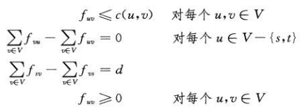

## 
线性规划

### 基本概念
* 标准型和松弛型
  - 标准型：所有的约束都是不等式
    1. 目标函数
    2. 约束，包括非负约束
    3. 最大化:cTx  
       满足约束 Ax≤b  x≥0
    4. 可行解： x满足所有约束条件
    5. 不可行解：x不满足至少一个约束条件
    5. 目标值：cTx  
    6. 最优解；目标值最大的可行解
    7. 最优目标解：cTx x
  - 标准化
    1. 大于等于 转换为小于等于 两边取负
    2. 非大于等于零约束 ，用x'-x'' 替换 x,x'≥0，x''≥0
    3. 等于约束 用 ≥ 和 ≤ 替换 =（x≥y 且 x≤y 则 x=y）
  - 松弛型：约束都是等式 (除非要求变量非负的约束)
  - 转换线性规划为松弛型
    1. 
    2. 
* 单纯形  
  如果有n个变量，每个约束定义了n维空间中的一个半空间，我们称这些半空间的交集形成的可行区域为单纯形

* 将问题表达为线性规划
  - 单对最短路径问题  
    1. 最大化 dt
    2. 满足约束 

    

  - 最大流(|V|^2+|V|-2)
    1. 最大化 

    
    2. 满足约束

     

  - 最小费用流
    1. 最小化 

    
    2. 满足约束 

    

  - 多商品流
    1. 最小化 0 不回去最小化任何目标函数
    2. 满足约束

    

    

### 习题
* 29.2-1  
流可能为负 dv'-dv''-(du'-du'')≤w(u,v) for every edge(u,v)   ds≤0

* 29.2-3

maximize ∑(v∈V)dv 不再松弛，如果是最小，则都取0，显然不对