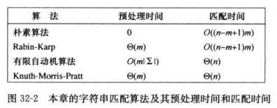
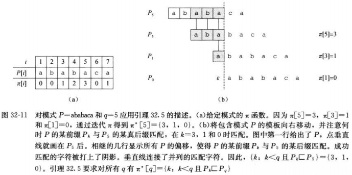
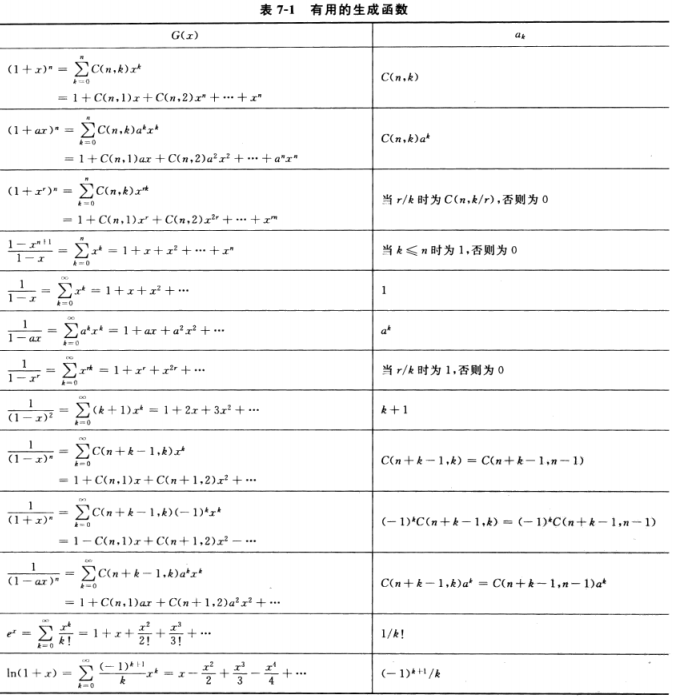

## <center>字符串匹配</center>



## 定理和引理及推论
* 引理32.1(后缀重叠引理)  
  假设x,y和z是满足x⊐z和y⊐z的字符串。如果|x|≤|y|,那么x⊐y;如果|x|≥|y|,那么y⊐x;如果|x|=|y|,那么x=y;
* 引理32.2(后缀函数不等式)  
  对任意字符串x和字符a,σ(xa)≤σ(x)+1  

* 引理32.3(后缀函数递归引理)  
  对任意x和字符a.若q=σ(x),则σ(xa)=σ(P<sub>q</sub>a)  

* 定理32.4
  如果φ是字符串匹配自动机关于给定模式P的终态函数，T[1...n]是自动机的输入文本，则对i=0,1,...,n,φ(Ti)=σ(Ti)

* 引理32.5(前缀函数迭代引理)  
  设P是长度为m的模式，其前缀函数为π，对q=1,2,...,m,有π<sup>* <sup>[q]={k:k＜q 且 P<sub>k</sub>⊐P<sub>q</sub>}

  π<sup>* <sup>[q]={π[q],π<sup>(2)<sup>[q],π<sup>(3)<sup>[q],π<sup>(4)<sup>[q],...,π<sup>(t)<sup>[q]}

* 引理32.6  
  设P是长度为m的模式，π是P的前缀函数。对q=1.

### 朴素字符串匹配算法

* NAIVE-STRING-MATCHER(T,P)
```
NAIVE-STRING-MATCHER(T,P)
  n=T.length
  m=P.length
  for s=0 to n-m
    if P[1..m]=T[s+1..s+m]
       print "Pattern occurs with shift" s
```
* 最坏 O((n-m+1)m)

* 如果P字符都不同。则 O(n)
```
NAIVE-STRING-MATCHER(T,P)
  n=T.length
  m=P.length
  for s=0 to n-m
     for k=1 to m
        if P[k]!=T[s+k]
           s=k
           continue
     print "Pattern occurs with shift" s
     s=s+m;
```

### Rabin-Karp 算法
* t<sub>s+1</sub>=10(t<sub>s</sub>-10<sup>m-1</su>T[s+1])+T[s+m+1]
* t<sub>s+1</sub>=(d(t<sub>s</sub>-T[s+1]h)+T[s+m+1])mod q
* RABIN-KARP-MATCHER(T,P,d,q)
* 复杂度 O(n)+O(m(v+n/q)) v是有效偏移量，如果v=O(1)并且q≥m,算法时间O(n)

```
RABIN-KARP-MATCHER(T,P,d,q)
  n=T.length
  m=P.length
  h=d^(m-1) mod q
  p=0
  t0=0
  for i=1 to m
    p=(dp+p[i])mod q
    t0=(dt0+T[i])mod q
  for s=0 to n-m
    if p==ts
      if P[1..m]==T[s+1..s+m]
         print "pattern occurs with shift" s
    if s<n-m
      ts+1=(d(ts-T[s+1]h)+T[s+m+1]) mod q
```

### 利用有限自动机进行字符串匹配
* 有限自动机 M
  - 是一个5元组(Q,q0,A,∑,δ)
  - Q是状态的有限集合
  - q0∈Q是初始状态
  - A⊆Q是一个特殊的接受状态集合
  - ∑是有限输入字母表
  - δ是一个从QX∑到Q的函数，成为M的转移函数
  - φ(ε)=q0
  - φ(ωa)=δ(φ(ω),a) , ω∈∑* ，a∈∑
  - δ(q,a)=σ(P<sub>q<sub>a)
  
* 代码

```
FINITE-AUTOMATON-MATCHER(T,δ,m)
   n=T.length
   q=0
   for i=0 to n
      q=δ(q,T[i])
      if q== m
         print "pattern occurs with shift" i-m

COMPUTE-TRANSITION-FUNCTION(P,∑) //O(m^3|∑|)
   m=P.length
   for q=0 to m
     for each charater a∈∑
        k=min(m+1,q+2)
        repeat
          k=k-1
        until Pk⊐Pqa
        δ(q,a)=k
   return δ
```

### kunth-Morris-Pratt 算法
* 模式自身匹配 P[1..k]=T[s'+1..s'+k]
* π[q] = max{k:k＜q 且 P<sub>k</sub>⊐P<sub>q</sub>}
* KMP



* KMP算法 

```
KMP-MATCHER(T,P) //O(n)
  n=T.length
  m=P.length
  π=COMPUTE-PERFIX-FUNCTION(P)
  q=0
  for i=1 to n
     while q＞0 and P[q+1]≠T[i]
        q=π[q]
     if P[q+1]==T[i]
        q=q+1
     if q==m
        print "Pattern occurs with shift " i-m
        q=π[q]


COMPUTE-PERFIX-FUNCTION(P) //O(m)
  m=P.length
  let π[1..m] be a new array
  π[1]=0
  k=0
  for q=2 to m
     while k＞0 and P[k+1]≠P[q]
        k=π[k]
     if P[k+1]==P[q]
        k=k+1
     π[q]=k
  return π
```


### 习题

* 32.1-4

```
OCCURANCE(T, P, t = 0, p = 0)
    if p == P.length
        return true
    if t == T.length
        return false
    if P[p] == '◇'
        return OCCURANCE(T, P, t, p + 1) || OCCURANCE(T, P, t + 1, p)
    else if T[t] == P[p]
        return OCCURANCE(T, P, t + 1, p + 1)
    else if p == 0
        return OCCURANCE(T, P, t + 1, p)
    return false
```




* 32.4-7 

find T' in TT

* 32.4-8

```
TRANSITION-FUNCTION(P, Σ)
	π = COMPUTE-PREFIX-FUNCTION(P)
	for a ∈ Σ do
	  δ(0, a) = 0
	end for
	  δ(0, P[1]) = 1
	for a ∈ Σ do
	   for q = 1 to m do
			if q == m or P[q + 1] 6= a then
			    δ(q, a) = δ(π[q], a)
	        else
	            δ(q, a) = q + 1
	        end if
	    end for
	end for
```

### show me your code
[cods](../codes/md32.cpp)