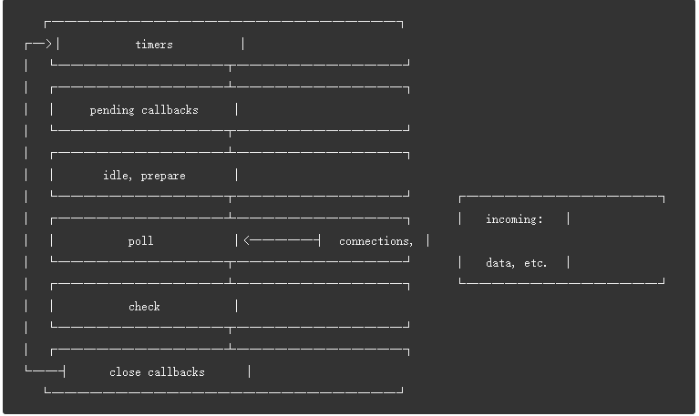

## <center>EventLoop</center>

### `uv_loop_s`

```cpp
#define UV_LOOP_PRIVATE_FIELDS
  /* The loop's I/O completion port */                                         \
  HANDLE iocp;                                                                 \
  /* The current time according to the event loop. in msecs. */                \
  uint64_t time;                                                               \
  /* Tail of a single-linked circular queue of pending reqs. If the queue */   \
  /* is empty, tail_ is NULL. If there is only one item, */                    \
  /* tail_->next_req == tail_ */                                               \
  uv_req_t* pending_reqs_tail;                                                 \
  /* Head of a single-linked list of closed handles */                         \
  uv_handle_t* endgame_handles;                                                \
  /* TODO(bnoordhuis) Stop heap-allocating |timer_heap| in libuv v2.x. */      \
  void* timer_heap;                                                            \
  /* Lists of active loop (prepare / check / idle) watchers */                 \
  uv_prepare_t* prepare_handles;                                               \
  uv_check_t* check_handles;                                                   \
  uv_idle_t* idle_handles;                                                     \
  /* This pointer will refer to the prepare/check/idle handle whose */         \
  /* callback is scheduled to be called next. This is needed to allow */       \
  /* safe removal from one of the lists above while that list being */         \
  /* iterated over. */                                                         \
  uv_prepare_t* next_prepare_handle;                                           \
  uv_check_t* next_check_handle;                                               \
  uv_idle_t* next_idle_handle;                                                 \
  /* This handle holds the peer sockets for the fast variant of uv_poll_t */   \
  SOCKET poll_peer_sockets[UV_MSAFD_PROVIDER_COUNT];                           \
  /* Counter to keep track of active tcp streams */                            \
  unsigned int active_tcp_streams;                                             \
  /* Counter to keep track of active udp streams */                            \
  unsigned int active_udp_streams;                                             \
  /* Counter to started timer */                                               \
  uint64_t timer_counter;                                                      \
  /* Threadpool */                                                             \
  void* wq[2];                                                                 \
  uv_mutex_t wq_mutex;                                                         \
  uv_async_t wq_async;


struct uv_loop_s {
  /* User data - use this for whatever. */
  void* data;
  /* Loop reference counting. */
  unsigned int active_handles;
  void* handle_queue[2];
  union {
    void* unused[2];
    unsigned int count;
  } active_reqs;
  /* Internal flag to signal loop stop. */
  unsigned int stop_flag;
  UV_LOOP_PRIVATE_FIELDS
};
```

### 事件循环

* 每个框都有一个 `FIFO`的`queue`，都是一个阶段
* 每个阶段的队列用尽或者回调限制，进入下一阶段



* Phases Overview
  - timers : `setTimeout()` and `setInterval`
  - pending callbacks : executes I/O callbacks deferred(推迟) to the next loop iteration
  - idle,prepare : only used internally
  - poll : node will block here when appropriate
  - check : `setImmediate()` callbacks are invoked here
  - close callbacks : some close callbacks,e.g. `socked.on("close",...)`

* Between each run of the event loop, Node.js checks if it is waiting for any asynchronous I/O or timers and shuts down cleanly if there are not any
* poll phase -> setImmediate -> timer

*  nextTickQueue will be processed after the current operation is completed,regardless of the current phase of the event loop
* 使用 `process.nextTick()` 的理由
  - 允许用户处理错误，清除所有不必要的资源，或者在事件循环继续之前重新尝试请求。
  - 有时，有必要让回调在调用栈解开之后但事件循环继续之前运行
  - 可用于控制代码执行顺序。保证方法在对象完成constructor后但是在I/O发生前调用。

### source code

```cpp
//node/deps/uv/src/unix/core.c
//uv_run(event_loop(),UV_RUN_ONCE)
//NodeMainInstance::Run()
//InspectorIo::ThreadMain()
//WorkerThreadsTaskRunner::Run()
//Watchdog::Run()
//Worker::Run()
//SyncProcessRunner::TryInitializeAndRunLoop()
//Agent::Start()
int uv_run(uv_loop_t* loop, uv_run_mode mode) {
  int timeout;
  int r;
  int ran_pending;

  r = uv__loop_alive(loop);
  if (!r) uv__update_time(loop);

  while (r != 0 && loop->stop_flag == 0) {
    uv__update_time(loop);
    uv__run_timers(loop);
    // 调用回调。通常来说回调一般在poll
    // fd结束后就立即执行，但是总有例外：有一些I/O回调会延迟到下一次迭代中执行。
    // 那些被延迟的回调正是在这里执行
    ran_pending = uv__run_pending(loop);
    uv__run_idle(loop);
    //执行prepare
    uv__run_prepare(loop);

    timeout = 0;
    //UV_RUN_ONCE 阻塞运行模式
    //UV_DEFAULT 阻塞运行到直到手动停止或没有被任何请求引用
    //UV_NOWAIT 运行一次循环流程，跳过了uv_backend_timeout这一步
    if ((mode == UV_RUN_ONCE && !ran_pending) || mode == UV_RUN_DEFAULT)
      //选定一个超时时间
      timeout = uv_backend_timeout(loop);

    uv__io_poll(loop, timeout);
    uv__run_check(loop);
    uv__run_closing_handles(loop);

    if (mode == UV_RUN_ONCE) {
      /* UV_RUN_ONCE implies forward progress: at least one callback must have
       * been invoked when it returns. uv__io_poll() can return without doing
       * I/O (meaning: no callbacks) when its timeout expires - which means we
       * have pending timers that satisfy the forward progress constraint.
       *
       * UV_RUN_NOWAIT makes no guarantees about progress so it's omitted from
       * the check.
       */
      uv__update_time(loop);
      uv__run_timers(loop);
    }

    r = uv__loop_alive(loop);
    if (mode == UV_RUN_ONCE || mode == UV_RUN_NOWAIT) break;
  }

  /* The if statement lets gcc compile it to a conditional store. Avoids
   * dirtying a cache line.
   */
  if (loop->stop_flag != 0) loop->stop_flag = 0;

  return r;
}

#define uv__has_active_handles(loop)                                          \
  ((loop)->active_handles > 0)
#define uv__has_active_reqs(loop)                                             \
  ((loop)->active_reqs.count > 0)

static int uv__loop_alive(const uv_loop_t* loop) {
  //return uv__has_active_handles(loop) || uv__has_active_reqs(loop) ||
         //loop->closing_handles != NULL;
  return loop->active_handles>0 || loop->active_reqs.count>0 || loop->closing_handles != NULL;
}
#define offsetof(s,m) ((::size_t)&reinterpret_cast<char const volatile&>((((s*)0)->m)))
#define container_of(ptr, type, member) \
  ((type *) ((char *) (ptr) - offsetof(type, member)))
void uv_update_time(uv_loop_t* loop) {
  uint64_t new_time = uv__hrtime(1000);
  assert(new_time >= loop->time);
  loop->time = new_time;
}

void uv__run_timers(uv_loop_t* loop) {
  // struct heap_node {
  // struct heap_node* left;
  // struct heap_node* right;
  // struct heap_node* parent;
  // };
  struct heap_node* heap_node;
  uv_timer_t* handle;

  for (;;) {
    //HEAP_EXPORT(struct heap_node* heap_min(const struct heap* heap)) {
       //return heap->min;
    //}
    // static struct heap* timer_heap(const uv_loop_t* loop) {
    // #ifdef _WIN32
    //   return (struct heap*)loop->timer_heap;
    // #else
    //   return (struct heap*)&loop->timer_heap;
    // #endif
    // }
    heap_node = heap_min(timer_heap(loop));
    if (heap_node == NULL) break;
    //uv_timer_t 中 heap_node 的位置 [uv_timer_t](./code/uv_timer_s.h)
    //已知heap_node的位置，找出uv_timer_t的位置
    handle = container_of(heap_node, uv_timer_t, heap_node);
    if (handle->timeout > loop->time) break;
    // int uv_timer_stop(uv_timer_t* handle) {
    //   if (!uv__is_active(handle)) return 0;
    
    // static struct heap* timer_heap(const uv_loop_t* loop) {
    // #ifdef _WIN32
    //   return (struct heap*)loop->timer_heap;
    // #else
    //   return (struct heap*)&loop->timer_heap;
    // #endif
    // }
    // #define uv__handle_stop(h)                                                     \
    //   do {                                                                         \
    //     if (((h)->flags & UV_HANDLE_ACTIVE) == 0) break;                           \
    //     (h)->flags &= ~UV_HANDLE_ACTIVE;                                           \
    //     if (((h)->flags & UV_HANDLE_REF) != 0) uv__active_handle_rm(h);            \
    //   } while (0)

    //   heap_remove(timer_heap(handle->loop),
    //               (struct heap_node*)&handle->heap_node,
    //               timer_less_than);
    //   uv__handle_stop(handle);

    //   return 0;
    // }
    // #define uv__is_active(h)                                                      \
    //   (((h)->flags & UV_HANDLE_ACTIVE) != 0)
    
    //停止uv_timer_t->uv_loop_t->timer_heap 最小堆上的最小timeout元素
    uv_timer_stop(handle);
    //迭代
    uv_timer_again(handle);
    handle->timer_cb(handle);
  }
}
```