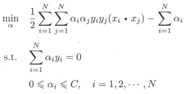
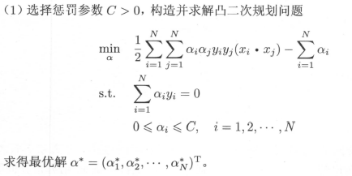
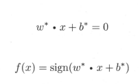

## 
支持向量机

### 线性不可分

* 原始问题(`C>0`)

* 原始问题拉格朗日函数(`αi≥0,μi≥0`)

* 线性支持向量机
  - `ω* · x + b* = 0`
  - `f(x) = sign(ω* · x + b*)`

* 对偶问题
   

* 定理

* 线性支持向量机学习算法
  - 输入
    - 训练数据集 `T={(x1,y1),(x2,y2),...,(xN,yN)},其中xi∈χ = Rn,yi∈Y = {-1，+1},i=1,2,...,N`
  - 输出
    - 分离超平面和分类决策函数 
  - 过程
    - 选择惩罚参数 C>0,构造并求解凸二次规划问题  
    
    - 计算w*  
    
    - 选择`α*`的一个分量`α*j`适合条件 `0<α*j<C`,计算  
    
    - 求得结果(分离超平面和分类决策函数)  
    