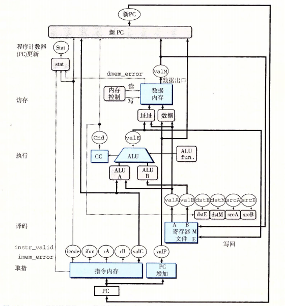

## <center>处理器体系结构</center>

### 基本概念
* `指令集体系结构(ISA)`
* `硬件控制语言(HCL)` - 描述系统控制部分的简单语言
* `冒险` - 一条指令的位置或操作数依赖于其他仍在流水线中的指令
* `寄存器标识符(register ID)`
* `寄存器指示符字节(register specifer byte)` - 操作符后面的寄存器
### Y86-64指令

* movq - `irmovq`,`rrmovq`,`mrmovq`,`rmmovq`
* 4个整数操作指令，OPq - `addq`,`subq`,`andq`,`xorq`,只对寄存器数据进行操作，设置三个条件码`ZF`,`SF`,`OF`
* 7个跳转指令，JXX - `jmp`,`jle`,`jl`,`je`,`jne`,`jge`,`jg`
* 6个条件传送指令，cmovXX - `cmovle`,`cmovl`,`cmove`,`cmovne`,`cmovge`,`cmovq`
* `call` - 指令将返回地址入栈，然后跳到目标地址，ret指令从这一的调用中返回
* `pushq`,`popq` - 入栈和出栈
* `halt` - 指令停止指令的执行，将导致处理器停止，并将状态码设置为HLT，x86-64中的`hlt`
* 指令编码  
  
* 程序寄存器存在CPU中的一个`寄存器文件`中。这个寄存器文件就是一个小的、以寄存器ID作为地址的随机访问存储器。

* 分支指令和调用指令的目的是一个绝对地址，区别于IA32中使用PC相对寻址方式
* 将指令转换成十六进制编码 - 不运算，只表示，地址小端发

### RISC 和 CISC
* `CISC` - 复杂指令集计算机
* `RISC` - 精简指令集计算机
* `Y86-64` 拥有上面两个属性，有条件码、长度可变的指令，并用栈保存返回地址。
  使用load/store体系结构和规则编码，通过寄存器来传递参数。

### 汇编代码
* `.` 开头的词是 `汇编伪指令`，告诉汇编器调整地址，以便在那儿产生代码或插入一些数据。  
  `.pos 0` - 告诉汇编器应该从0出开始产生代码  
  
   栈开始的地址
  ```s
  #stack starts here and grows to lower addresses
         .pos 0x200
   stack:
  ```

### Y86-64的顺序实现
1. 取指(fetch) - 从内存读取指令字节，地址为程序计数器(PC)的值
2. 译码(decode) - 从寄存器文件读入最多两个操作数，2==%rdx=值
3. 执行(excute) - 这个阶段会决定是不是应该选择分支
4. 访存(memory) - 从内存读数据或写入内存数据，读出的值为valM
5. 写回(write back) - 写两个结果到寄存器文件
6. 更新PC(PC update) - 将pc设置成下一条指令的地址

### SEQ实现
包括组合逻辑和两种存储器设备:时钟存储器(程序计数器和条件码寄存器)，随机访问存储器(寄存器文件、指令内存和数据内存)




* 每个时钟周期，程序计数器都会装载新的指令地址，只有在执行整数运算指令时，才会装载条件码寄存器。只有在执行rmmovq、pushq、call指令时，才会写数据内存。

* 原则  
  1. 从不回读 - 处理器从来不需要为了完成一条指令的执行而去读由该指令更新的状态。