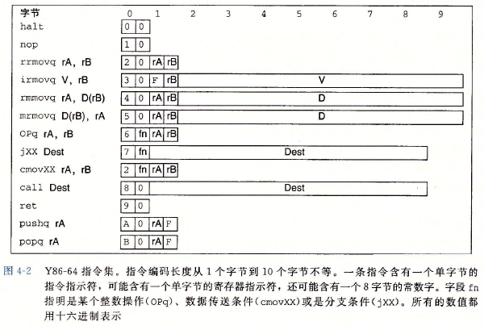
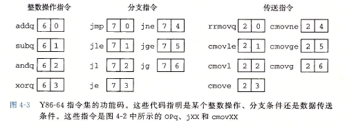
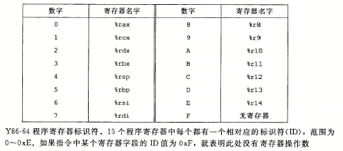

## <center>处理器体系结构</center>

### 基本概念
* `指令集体系结构(ISA)`
* `硬件控制语言(HCL)` - 描述系统控制部分的简单语言
* `冒险` - 一条指令的位置或操作数依赖于其他仍在流水线中的指令
* `寄存器标识符(register ID)`
* `寄存器指示符字节(register specifer byte)` - 操作符后面的寄存器
### Y86-64指令

* movq - `irmovq`,`rrmovq`,`mrmovq`,`rmmovq`
* 4个整数操作指令，OPq - `addq`,`subq`,`andq`,`xorq`,只对寄存器数据进行操作，设置三个条件码`ZF`,`SF`,`OF`
* 7个跳转指令，JXX - `jmp`,`jle`,`jl`,`je`,`jne`,`jge`,`jg`
* 6个条件传送指令，cmovXX - `cmovle`,`cmovl`,`cmove`,`cmovne`,`cmovge`,`cmovq`
* `call` - 指令将返回地址入栈，然后跳到目标地址，ret指令从这一的调用中返回
* `pushq`,`popq` - 入栈和出栈
* `halt` - 指令停止指令的执行，将导致处理器停止，并将状态码设置为HLT，x86-64中的`hlt`
* 指令编码  
  
* 程序寄存器存在CPU中的一个`寄存器文件`中。这个寄存器文件就是一个小的、以寄存器ID作为地址的随机访问存储器。

* 分支指令和调用指令的目的是一个绝对地址，区别于IA32中使用PC相对寻址方式
* 将指令转换成十六进制编码 - 不运算，只表示，地址小端发

### RISC 和 CISC
* `CISC` - 复杂指令集计算机
* `RISC` - 精简指令集计算机
* `Y86-64` 拥有上面两个属性，有条件码、长度可变的指令，并用栈保存返回地址。
  使用load/store体系结构和规则编码，通过寄存器来传递参数。

### 汇编代码
* `.` 开头的词是 `汇编伪指令`，告诉汇编器调整地址，以便在那儿产生代码或插入一些数据。  
  `.pos 0` - 告诉汇编器应该从0出开始产生代码  
  
   栈开始的地址
  ```s
  #stack starts here and grows to lower addresses
         .pos 0x200
   stack:
  ```