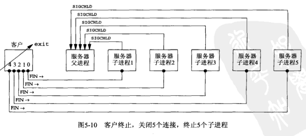

## <center>TCP客户/服务器程序示例</center>

### 代码

[server.c](../server.c)

[client.c](../client.c)

### POSIX信号处理
* sigaction函数
* SIGCHLD 信号就是由内核在任何一个进程终止时发送给它的父进程的一个信号
* SIGKILL,SIGSTOP 不能被捕获,也不能被忽略-SIG_IGN
* 信号捕获函数
  - 单一整数调用
  - 没有返回值
  - 原型 `void handler(int signo)`
* POSIX保证被捕获的信号在其信号处理函数运行期间总是阻塞的

### wait 与 waitpid 函数
```c
#include <sys/wait.h>
pid_t wait(int *statloc);
pid_t waitpid(pid_t pid,int *statloc,int options);
//返回：成功返回进程id，若出错则为0或-1
```
* 返回已终止进程的id号，以及通过statloc指针返回的子进程终止状态
* wait阻塞到现有子进程第一个终止为止
* pid指定想等待的进程ID，值-1表示等待第一个终止的子进程
* WNOHANG 没有已终止进程时不要阻塞


```c
void sig_chld(int signal)
{
	pid_t pid;
	int stat;
	//pid = wait(&stat);//wait取到子进程的pid和终止状态 
	while((pid=waitpid(-1,&stat,WNOHANG))>0)
	  printf("child %d terminated\n",pid);
	return;
}
```