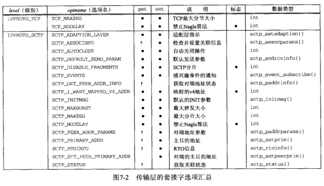
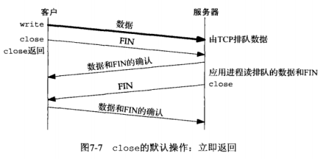
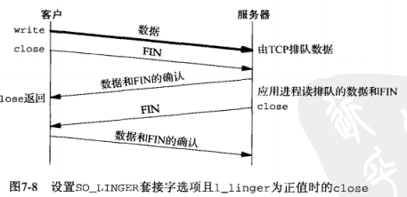
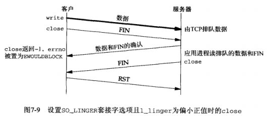
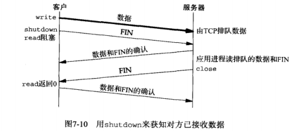
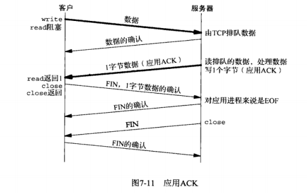
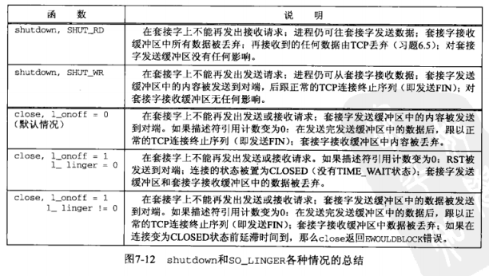

## <center>套接字选项</center>

### getsockopt 和 setsockopt
```c
#include <sys/socket.h>
int getsockopt(int sockfd,int level,int optname,void *optval,socklen_t *optlen);
int setsockopt(int sockfd,int level,int optname,const void *optval,socklen_t optlen);
//均返回：若成功则为0，若出错则为-1
```

* sockfd 必须指向一个打开的套接字描述符
* level(级别)指定系统中解释选项的代码或为通用套接字代码，或为某个特定于协议的代码
* optval是一个指向某个变量(* optval)的指针
* setsockopt从 * optval中取得选项待设置的新值
* getsockopt则把已获取的选项当前值存放到 * optval中
* * optval的大小由最后一个参数指定
* 套接字选项粗分为两大基本类型：
  - 启用或禁止某个特性的二元选项(标志选项)
  - 取得并返回我们可以设置或检查的特定值的选项(值选项)




### 检查选项是否受支持并获取默认值
[checkopts](../checkopts.c);

### 套接字状态
* 由TCP已连接套接字从监听套接字继承来
   - SO_DEBUG
   - SO_DONTROUTE
   - SO_KEEPALIVE
   - SO_LINGER
   - SO_OOBINLINE
   - SO_RCVBUF
   - SO_RCVLOWAT
   - SO_SNDBUF
   - SO_SNDLOWAT
   - TCP_MAXSEG
   - TCP_NODELAY

### 通用套接字
* 协议无关的
* SO_DONTROUTE
* SO_DEBUG
  - 当给一个TCP套接字开启本选项时，内核将为TCP在该套接字发送和接收的所有分组保留详细跟踪信息

* SO_DONTROUTE 
  - 规定外出的分组绕过底层协议的正常路由机制
* SO_ERROR
  - 内核能够以下面两种方式之一立即通知进程这个错误
    - 如果进程阻塞在对该套接字的select调用上，那么无论是检查可读条件还是可写条件，select均返回并设置其中一个或所有两个条件
    - 如果进程使用信号驱动是I/O模型，那就给进程或进程组产生一个SIGIO信号
  - 一个套接字上出现的待处理错误一旦返回给用户进程，它的so_error就得复位为0
* SO_KEEPALIVE
   - 如果2小时内在该套接字的任一方向没有数据交换，TCP就自动给对端发送一个`保持存活探测分节`。

   - 对端以RST响应，它告知本端TCP：对端已崩溃重启动，该套接字的待处理错误被置为ECONNRESET,套接字本身则被关闭

   - 对端对保持存活探测分节没有任何响应。在规定时间内没得到任何响应则放弃

   

* SO_LINGER
  - 指定close函数对面向连接的协议如何操作。默认是close立即返回，但是如果有数据残留在套接字发送缓存区中，系统将试着把这些数据发送给对端
  ```c
  struct linger{
  	int l_onoff;/*o-off,nonzero=on*/
  	int l_linger;/*linger time,POSIX specifies units as seconds*/
  }
  ```

  - 如果 l_onoff为0，那么关闭本选项
  - 如果 l_onoff为非0且 l_linger为0，那么当close某个连接时TCP将中止该连接。即TCP将丢弃保留在套接字发送缓冲区中的任何数据，并发送一个RST给对端，并没有通常的四分组连接终止序列
  - 如果l_onoff为非0且l_linger也为非0，那么当套接字关闭时内核将拖延一段时间。如果在套接字发送缓冲区中仍残留有数据，那么进程将被投入睡眠，知道所有数据都已发送完且均被对方确认或延滞时间到(EWOULDBLOCK,残留数据被丢弃)
  - shutdown(并设置第二个参数为SHUT_WR)，等到接受了对端的FIN才返回
  

  

  

  

  ```c
  //应用级确认
  char ack;
  write(sockfd,data,nbytes);
  n = read(sockfd,&ack,1);


  nbytes = read(sockfd,buff,sizeof(buff));
  write(sockfd,"",1);
  ```

  

  

* SO_OOBINLINE
  - 当本选项开启时，带外数据将被留在正常的输入队列中(即在线留存)

* SO_RCVBUF 和 SO_SNDBUF
  - 接收缓冲区被TCP、UDP和SCTP用卡保存接收到的数据，知道由应用进程来读取
  - 这两个套接字选项允许我们改变这两个缓冲区的大小。
  - TCP的窗口规模选项是在建立连接时用SYN分节与对端互换得到的
  - 对于客户，SO_RCVBUF选项必须在调用connect之前设置
  - 对于服务器，这意味着该选项必须在调用listen之前给监听套接字设置
  - 所以必须给监听套接字设置本选项
  - TCP套接字缓冲区的大小至少应该是相应连接的MSS值的四倍，根据TCP快速算法的工作机制


  - 管道的容量称为带宽-延迟积，它通过将带宽和RTT(往返时延)相乘，再将结果由位转换为字节计算得到

* SO_RCVLOWAT 和 SO_SNDLOWAT 套接字选项
  - 接收低水位标记和发送低水位标记，由select函数使用
  - 接收低水位标记是让select返回“可读”时套接字接收缓冲区中所需的数据量，对TCP、UDP和SCTP套接字，其默认值为1
  - 发送低水位标记是让select返回“可写”时套接字发送缓冲区中所需的可用空间，TCP默认2048

* SO_RCVTIMEO和SO_SNDTIMEO 套接字选项
  - 这两个选项允许我们给套接字的接收和发送设置一个套接字
  - 接收超时影响5个输入函数：read、readv、recv、recvfrom、recvmsg
  - 发送超时影响5个输出函数：write、writev、send、sendto、sendmsg