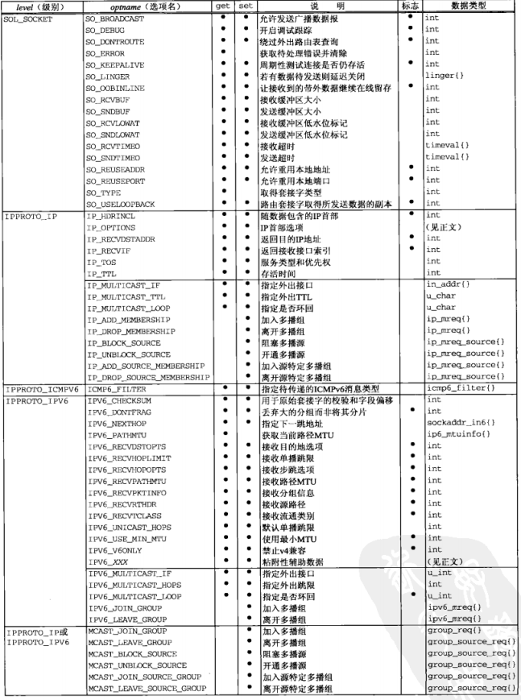

## <center>套接字选项</center>

### getsockopt 和 setsockopt
```c
#include <sys/socket.h>
int getsockopt(int sockfd,int level,int optname,void *optval,socklen_t *optlen);
int setsockopt(int sockfd,int level,int optname,const void *optval,socklen_t optlen);
//均返回：若成功则为0，若出错则为-1
```

* sockfd 必须指向一个打开的套接字描述符
* level(级别)指定系统中解释选项的代码或为通用套接字代码，或为某个特定于协议的代码
* optval是一个指向某个变量(* optval)的指针
* setsockopt从 * optval中取得选项待设置的新值
* getsockopt则把已获取的选项当前值存放到 * optval中
* * optval的大小由最后一个参数指定
* 套接字选项粗分为两大基本类型：
  - 启用或禁止某个特性的二元选项(标志选项)
  - 取得并返回我们可以设置或检查的特定值的选项(值选项)




### 检查选项是否受支持并获取默认值
