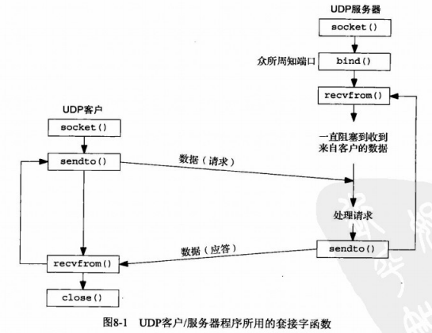

## <center>基本UDP套接字编程</center>



### recvfrom和sendto函数

```c
#include <sys/socket.h>
ssize_t recvfrom(int sockfd,void *buff,size_t nbytes,int flags,struct sockaddr *from,socklen_t *addrlen);

ssize_t sendto(int sockfd,const void *buff,size_t nbytes,int flags,const struct sockaddr *to,socklen_t *addrlen);

//均返回：若成功则为读或写的字节数，若出错则为-1
```

* 写一个长度为0的数据报是可行的。在UDP情况下，这会形成一个只包含一个IP首部(对于IPV4通常为40字节，对于IPV6通常为40个字节)和一个8字节的UDP首部而没有数据的数据报。
* 如果recvfrom的from参数是一个空指针，那么相应的长度参数addrlen也必须是一个空指针，表示我们不关心数据发送者的协议地址


* 每个UDP套接字都有一个接收缓冲区
* 当进程调用recvfrom时，缓冲区中的下一个数据报以FIFO顺序返回给进程


